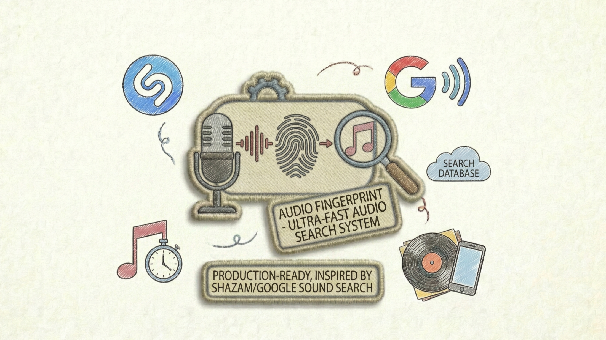
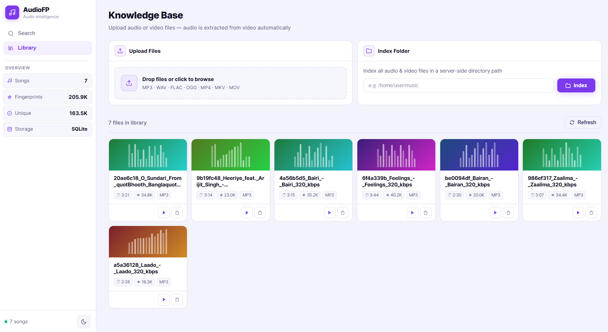
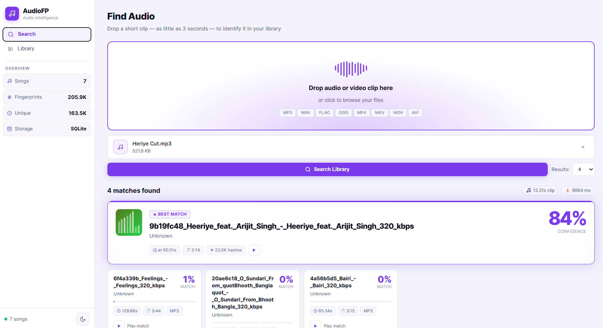
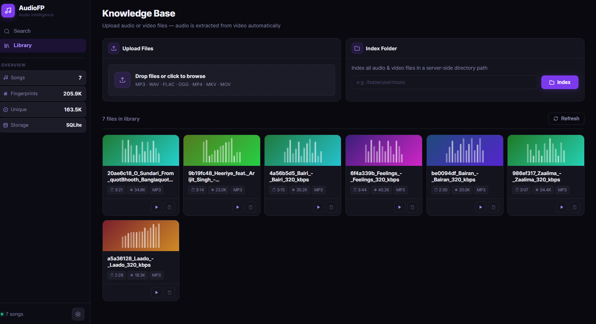

# AudioFP - Audio Intelligence Platform

> Google-like audio search for your private audio library.  
> Upload a 3-second clip and instantly find where it appears across thousands of files.

<p align="center">
  
</p>

Audio Finger Print is a production-ready, self-hosted audio fingerprinting platform. It combines a high-accuracy Shazam-style matching engine with a clean web interface, letting you build a searchable audio knowledge base from your own files - no cloud, no transcription, no API keys required.

---

## Features

- **Short-clip search** - recognise audio from clips as short as 3 seconds, even with background noise
- **Exact & near-match** - Shazam-style spectral fingerprinting with time-offset voting
- **Match timestamp** - tells you exactly where in the original recording the clip comes from
- **Batch indexing** - upload individual files or point to a local folder; indexing runs in the background
- **Fast search** - batch hash lookups in a single SQL query; SQLite with WAL mode, covering index, and 64 MB page cache
- **500 MB upload limit** - handles large uncompressed WAV files out of the box
- **Simple UI** - drag-and-drop search, library management, and live stats in one page
- **REST API** - every feature is accessible via a JSON API for programmatic use

---

## UI Screenshots








## Quick Start

**Prerequisites** - install [FFmpeg](https://ffmpeg.org/) (or [SoX](https://sourceforge.net/projects/sox/)) so the platform can decode all supported audio formats:

```bash
# macOS
brew install ffmpeg

# Ubuntu / Debian
sudo apt-get install ffmpeg

# Windows (via Chocolatey)
choco install ffmpeg

# Windows (via Scoop)
scoop install ffmpeg
```

Verify the installation:

```bash
ffmpeg -version
```

Then:

```bash
# 1. Clone and install dependencies
git clone https://github.com/your-org/audio-fingerprint.git
cd audio-fingerprint
pip install -r requirements.txt

# 2. Start the server
python run.py

# 3. Open the browser
# → http://localhost:5000
```

The server creates `data/fingerprint_dev.db` on first run. Your library persists across restarts.

### Options

```bash
python run.py --port 8080                   # custom port
python run.py --env production --port 80    # production config
```

<hr>

## REST API

The full API lives under `/api/v1`. See [docs/API.md](docs/API.md) for complete reference.

---

## Configuration

| Variable | Default | Description |
|----------|---------|-------------|
| `STORAGE_TYPE` | `sqlite` | `memory` · `sqlite` · `postgres` |
| `SQLITE_DATABASE_PATH` | `data/fingerprint_dev.db` | SQLite file path |
| `UPLOAD_FOLDER` | `data/uploads` | Where uploaded files are saved |
| `SAMPLE_RATE` | `11025` | Audio sample rate (Hz) |
| `FAN_VALUE` | `10` | Hash pairs per anchor peak (higher = more robust) |
| `MAX_CONTENT_LENGTH` | `500 MB` | Maximum upload size |

Edit `config/development.py` (dev) or `config/production.py` (prod) to change defaults.

---

## Architecture

<p align="center">
  
</p>

The platform has two main data flows:

1. **Training & Indexing** - Audio files are loaded, preprocessed, passed through spectral peak extraction and hash generation, then stored in the fingerprint database.
2. **Application & Search** - User query clips follow the same fingerprinting pipeline, and the matcher queries the database to score and return the best matches via the Flask REST API.

See [docs/ARCHITECTURE.md](docs/ARCHITECTURE.md) for the full algorithm walkthrough.

---

## License

MIT - see [LICENSE](LICENSE).
